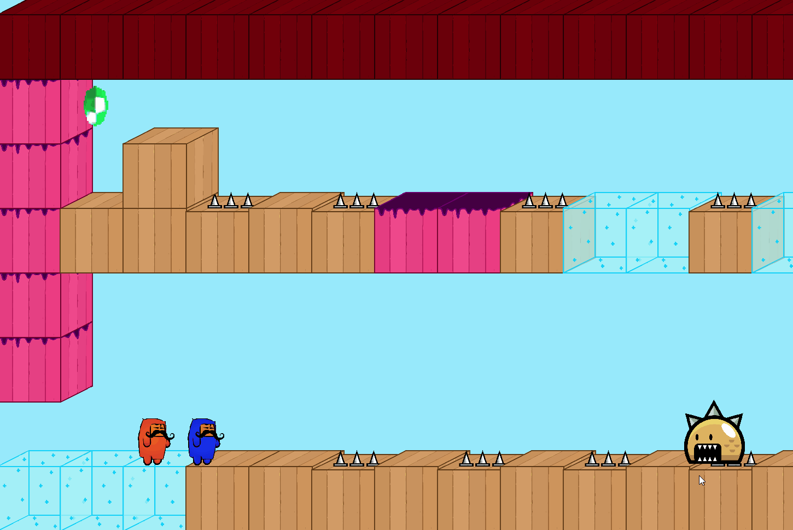
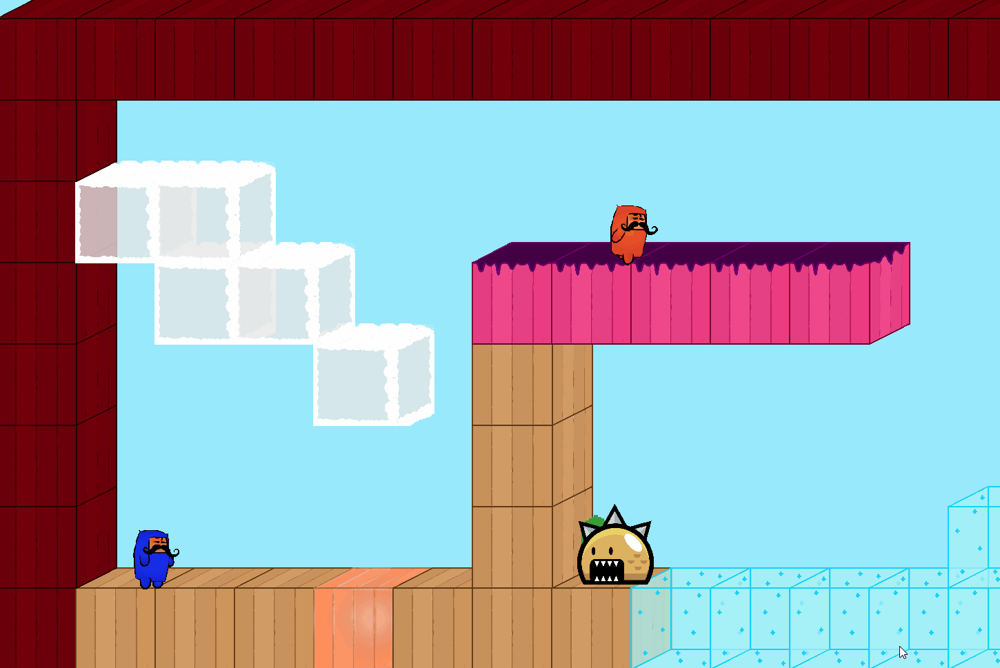
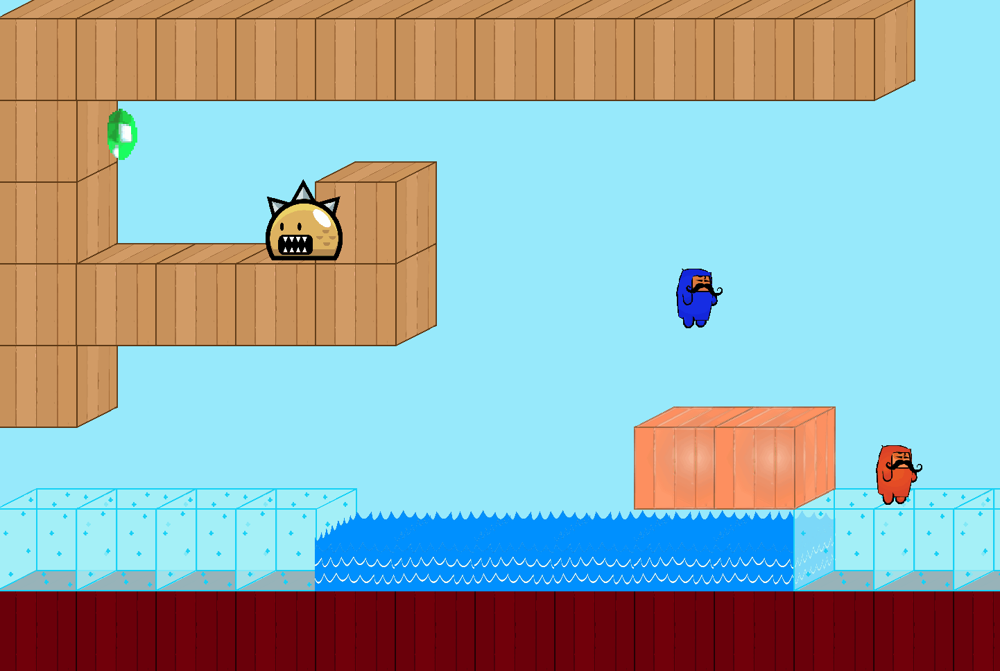

# 2D-Platformer-Game
This video game was created with a partner for my final project in AP Computer Science 11.

The project was used to strengthen my knowledge and apply the key concepts of Object Oriented Programming.
Key Concepts include: Encapsulation, Abstraction, Polymorphism, Inheritance.

The aim of the game is to complete all the levels by working together with your partner. 
Player 1 Controls: WASD to move, "E" to fire weapon.
Player 2 Controls: Arrow Keys to move, "M" key to fire weapon.

GAME FEATURES:
1. Both players can double jump
2. Both players have a projectile. Player 1 kills enemies, Player 2 slows enemies down.
 
3. Enemies have a tracking system that allows them to follow the nearest player so they don't just move randomly

4. Gems and Stars are added into the game to provide a point system for players to try to get the most possible points  
5. There are 8 different types of platforms/blocks you can encounter, each block has a different ability. Examples: slow player, kill player, bounce player into the air. 
 
 

